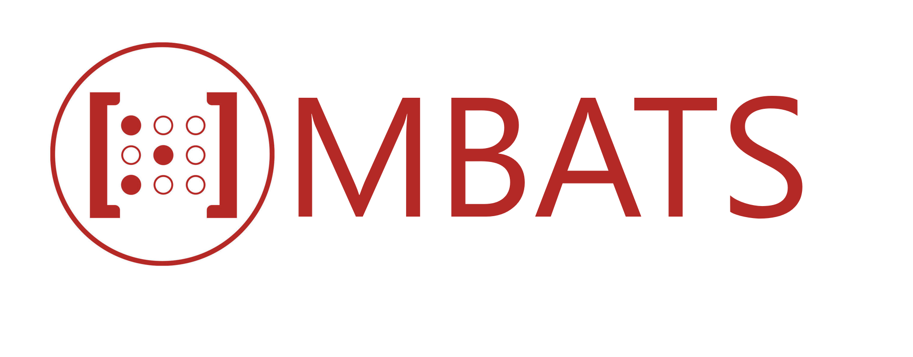

<p align="center">
    <a target="_blank"></a>
    <br />
    <br />
    <b>Microservices Based Algorthmic Trading System</b>
    <br />
    <br />
</p>

[](https://opensource.org/licenses/BSD-3-Clause)

---

MBATS is a docker based platform for developing, testing and deploying Algorthmic Trading strategies with a focus on Machine Learning based algorithms.

MBATS aim to make a Quant's life a lot easier by providing a modular easy to setup trading infrastrucutre based on open source tools that can get his/her trading strategy from idea to production within few minutes.

Using MBATS, you can easily create Trading Strategies in Backtrader, manage machine learning models with Ml-Flow, a Posgress database for storing and querying Market data, storage and file management database based on Minio, Superset to visualize performance of backtested and live strategies, schedule tasks using Apache Airflow and many other features to help you get more results in faster times and with a lot less code.


[Linkedin Article about MBATS](https://www.linkedin.com/post/edit/6619730514188267520/)

  idea

Table of Contents:

- [Quickstart](#Quickstart)
- [Getting Started](#getting-started)
  - [Backtrader](#Backtrader)
  - [Mlflow](#Mlflow)
  - [Airflow](#Airflow)
  - [Superset](#Superset)
  - [Minio](#Minio)
  - [Postgres](#Postgres)
- [Cloud](#Cloud)
- [Current Features](#Current Features)
- [Planned Features](#Planned Features)
- [Contributing](#Contributing)
- [License](#License)
- [Authors](#Authors)
- [Acknowledgments](#Acknowledgments)
      
## Quickstart

[](https://youtu.be/2ivKEj3ksPk)

MBATS is based on Docker containers. Running your Infrastructure is as easy as running one command from your terminal. You can either run MBATS on your local machine or on the cloud using docker-compose.

The easiest way to start running your MBATS is by running our docker-compose file. Before running the installation command make sure you have [Docker](https://www.docker.com/products/docker-desktop) installed on your machine:

This project has been devloped and tested on both [WSL](https://docs.microsoft.com/en-us/windows/wsl/about) and [Docker Toolbox](https://docs.docker.com/toolbox/toolbox_install_windows/). Its been developed using Visual Studio Code and the main reason being the [Container Debugger feature](https://code.visualstudio.com/docs/remote/containers#_debugging-in-a-container) 

1. Downlod/Clone the Github Repository (Make sure your Docker Machine has access to the location):  
  ```git clone https://github.com/YOUR-USERNAME/YOUR-REPOSITORY```
2. Update the 'WD' variable in .env file to the location of the Cloned directory:`
3. Run the Docker containers:  
 ```docker-compose up -d --build```  
First time would take some time to download all the required docker images. 
Once the Docker compose is running, you can access the following components from the webaddress
* Jupyter Notebook:http://localhost:8888
* Airflow: http://localhost:8080
* Mlflow: http://localhost:5500
* PgAdmin: http://localhost:1234
* Superset: http://localhost:8088
* Minio: http://localhost:9000

4. Run the script to setup up the database schema   
```.\starter_script.bat```
5. All the infrastructure and business logics is in Storage folder and the necessary components are shared across containers.  
- [Trading Strategies](Storage\q_pack\q_strategies)
- [Analyzers](Storage\q_pack\q_analyzers)
- [Datafeeds Cnnectors](Storage\q_pack\q_datafeeds)
- [Airflow DAGS](Storage\airflow\dags)
- [Supporting files for Airflow](Storage\minio\storage\airflow-files)
- [Minio Storage](Storage\minio)
- [DB Schema builders](Storage\q_pack\db_pack)
- [Machine Learning input files](Storage\minio\storage\model-support-files)(Storage\minio\storage\model-support-files)
- [MLflow artifacts](Storage\minio\storage\mlflow-models)

6. You can choose what tickers to download by setting it up in  [interested_tickers.xlsx](Storage\minio\storage\airflow-files\)
The 'daily' tab for listing the tickers for which EOD data is to be downloaded and 'minute' tab for downloading at 1 minute interval. 
7. Switch on the [fx_data_download](Storage\airflow\dags)  DAG on Airflow(http://localhost:8080) and this will download the Daily and Minute data for tickers you have set in the interested_tickers.xlsx
8. Go to Jupyter Notebook(http://localhost:8888) and use the Notebook Example.ipynb to run through the example strategy implementation where you can 
- Run Backtrader trading strategies (Backtest or Live)
- Preprocess the Market Data plus Indicator logs for preparing for machine learning. 
- Run Machine Learning models on the preprocessed data and track it to MLflow.
- Serve the Machine Learning Artifcat(model) via MLflow
- Bonus features of MLflow (Packaging and Serving via Rest API)
9. To check the Backtest or Live trading results go to Superset:http://localhost:8088
10. You can schedule Live trading strategies by using the [strategy.csv](Storage\minio\storage\airflow-files) and the dynamic [DAG dag_strategy_dynamic](Storage\airflow\dags) 


## Getting Started


MBATS is a collection of 9 docker containers acting synchronously to create an environment to develop and productionise trading strategies with ease. The main parts of the MBATS are as follows.

### [Backtrader](https://www.backtrader.com/)
[Backtrader](https://www.backtrader.com/) is an python based opensource event-driven trading strategy backtester with support for live trading. The reason why I choose Backtrader over other opensource backtesters like  [Zipline](https://github.com/quantopian/zipline) and [QuantConnect Lean](https://github.com/QuantConnect/Lean) is because of the great the great documentation and its community driven.
Here's a list of subclasses I have written for this project that are derived classed from Backtrader package. 
* [**Run**](Storage\q_pack\q_run\run_BT.py) - Script that combines the strategy, analyzers and the datafeeds. 
* [**Strategy**](Storage\q_pack\q_strategies) - A simple Daily trading strategy that initiates bracket orders based on RSI and Stochastic Indicator.
* [**Logger Analyzer**](Storage\q_pack\q_analyzers\bt_logger_analyzer.py) - Logs the price data and the technical indicator which is used for training the Machine Learning model
* [**Strategy Performance Analyzer**](Storage\q_pack\q_analyzers\bt_strat_perform_analyzer.py) - Measures difference performance metrics of round trip trades and save it in the database which can be later consumed in BI tool (Superset).
* [**Round trip trade Performance Analyzer**](Storage\q_pack\q_analyzers\bt_pos_perform_analyzer.py) - Measures difference performance metrics of round trip trades and save it in the database which can be later consumed in BI tool (Superset).
* [**Transaction Analyzer**](Storage\q_pack\q_analyzers\bt_pos_perform_analyzer.py) - Records the executed orders into the database. 
* [**Stategy ID Analyzer**](hStorage\q_pack\q_analyzers\bt_pos_perform_analyzer.py) - Keep a record of the metadata of the backtest or live strategy ran.
* [**Oanda Broker Store**](https://github.com/ftomassetti/backtrader-oandav20)
* [**Postgress Data Feed**](point to the feed)

<p align="center"></p>


### [MLflow](https://mlflow.org/)

Anyone who has worked in the Datascience field would have heard about [Spark](https://spark.apache.org/), well the founders of Spark have brought a similar disruptive tool to revolutionize the Machine Learning landscape and that is MLflow. Mlflow is an open source platform to manage the ML lifecycle, including experimentation, reproducibility and deployment. It currently offers four components:
* MLflow Tracking
* MLflow Projects
* MLflow Models
* MLflow Registry (Released in 1.4)

There are a few other organizations that try to address this problem but what seperates MLflow from the likes of [Google-TFX](https://www.tensorflow.org/tfx), [Facebook-FBLearner Flow](https://engineering.fb.com/core-data/introducing-fblearner-flow-facebook-s-ai-backbone/) and [Uber-Michelangelo](https://eng.uber.com/michelangelo/) is that MLFlow try to address the concerns of the crowd rather than a single organization and therefore they are universal and community driven to an extend that [AWS](https://aws.amazon.com/blogs/machine-learning/build-end-to-end-machine-learning-workflows-with-amazon-sagemaker-and-apache-airflow/) and [Azure](https://docs.microsoft.com/en-us/azure/machine-learning/how-to-use-mlflow) has provided integration for MLflow. 

In this project all the ML model can be tracked by the MLflow Tracker and the model artifacts are stored in Minio, the main reason for doing so is that later on I can swap Minio for a Cloud object store like S3. The ML models are then served using MLflow pyfunc. We also have the option to serve the model as Rest API using MLFlow (code in sample jupyter notebook)
    
## [Airflow](https://airflow.apache.org/)
Apache Airflow is an open-source workflow management platform, basically Chron on steroids and it has wide array of integration with popular platforms and data stores. 
In this this project we use airflow for scheduling two tasks mainly. One [DAG]() for downloading daily and minute data into the Database controlled by an excel file and another [Dynamic DAG]() for schedulling live strategies controlled by a csv file. 

## [Apache Superset](https://superset.apache.org/)
From the creators of Apache Airflow, Apache Superset is a Data Visualization tool initially designed by Airbnb and later open sourced for the community.
Superset is an interactive Data Exploration toll that will let you slice, dice and visualize data. Why pay for Tableau and PowerBi when you can use something that opensource. We use Superset to visualize Backtesting and Live trading performance.  

Username:guest  
Password:guest 

The dashboards and user details are stored in Storage/superset/superset.db   
If you want to reset the crednetials and create new dashboard, just delete this sqlite DB and create a new one with  
```touch superset.db```  
Then once the container is up and running execute  
```docker exec -it superset superset-init```

## [Minio](https://min.io/)
MinIO is pioneering high performance object storage. With READ/WRITE speeds of 55 GB/s and 35 GB/s on standard hardware, object storage can operate as the primary storage tier for a diverse set of workloads. Amazon’s S3 API is the defacto standard in the object storage world and represents the most modern storage API in the market. MinIO adopted S3 compatibiity early on and was the first to extend it to support S3 Select. Because of this S3 Compatibility by using Minio we have an upperhand of moving towards the Cloud on a later stage when it comes time for scaling and move into the cloud. 

## [PostgreSQL](https://www.postgresql.org/)
We have 2 Databases in our PosgresSQL server, 1 is the Security Master database that stores the Daily and Minute data for Forex Symbols in 2 seperate tables. 
Another Database is used for storing the position information and the performance metrics. 
The Databases can be managed through PgAdmin  
Username:guest  
Pass:guest

## Scalling to the Cloud
MLFlow has been developed by the Databricks team and therefore its native in their environment, but also the popularity and adoption of this tool has also ensured it a place in AWS Sage Maker and Azure. Every technology used in this project has a synonymus managed service offered in the cloud.
And the best part of scalling such an microsservices based architecture is that you can do it step by step rather than do it as a whole. Moreover if the cloud is using the same technology then the migration can happen with minimal changes. A simple example for this would be GCP Cloud Composer which is built on top of Apache Airflow and Kubernettes which means that all the DAG's that we are using in this project can be used in cloud composer as well. Similarly I have found GCP has a better strategy and technology in place for building a hybrid cloud based infrastrucure and for that reason here's architecture if this project has to be transfered into the GCP platform. 


## Current Features
* Backtesting and Live trading Forex using Oanda
* Multiple symbol strategy support.
* Multiple strategy support.
* Market data download and Live trading scheduling using Airflow.
* Machine Learning model development and deployment using MLflow.
* Superset BI Dashboard for real-time monitoring of Live trading and backtesting performance results.
* Easily extensible to support any kind of structured data.
* Written in Python
* Infrastructure as Code – less than 5 minutes from scratch to a fully functional trading infrastructure.


## Planned Features

* Support for Equity Database (Backtrader supports [Interactive Brokers out of the box](https://www.backtrader.com/docu/live/ib/ib/]))
* Celery/Kubernetes cluster support for Airflow
* More performance and trade analytics dashboards on Superset 
* Dynamic DAG for model retraining.
* More Backtrader Examples involving -
    - Custom Indicators.
    - Alternative Data (Unstructured Data Pipeline)
    - [Reinforcement Learning](https://github.com/saeed349/Deep-Reinforcement-Learning-in-Trading).
* Use [MLflow Model Registry](https://www.mlflow.org/docs/latest/model-registry.html).
* Integrate [Alpaca API Store](https://alpaca.markets/)
* Automatic Model Selection for Strategies based on ML performance metrics.

## Contributing

All code contributions must go through a pull request and approved by a core developer before being merged. This is to ensure proper review of all the code.

## License

This repository is available under the [BSD 3-Clause License](./LICENSE).

## Authors

* **Saeed Rahman** - [LinkedIn](https://www.linkedin.com/in/saeed-349/)


## Acknowledgments

* [Backtrader community](https://community.backtrader.com/)
* [Backtest-rookies](https://backtest-rookies.com/category/backtrader/)  
* [Backtrader Oanda V20 Store](https://github.com/ftomassetti/backtrader-oandav20)
* [Beyond Jupyter notebook - Udemy course](https://www.udemy.com/course/beyond-jupyter-notebooks/)
* [Quantstart](https://www.quantstart.com/)
